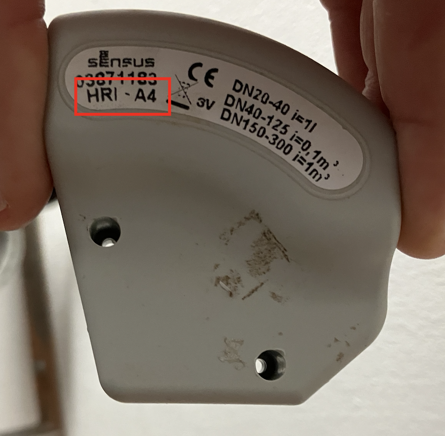
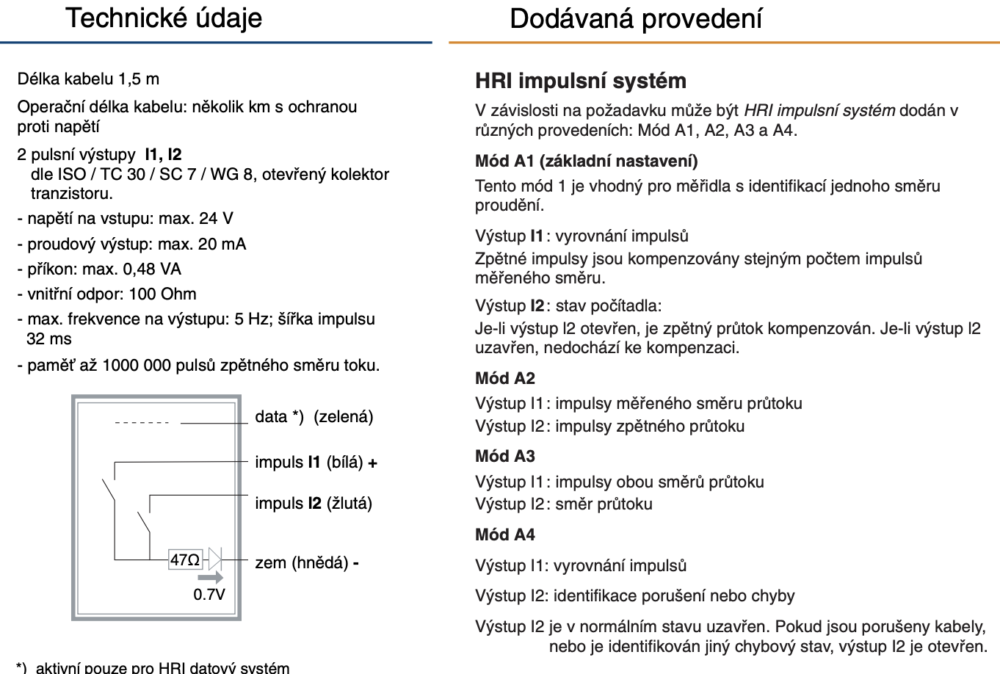
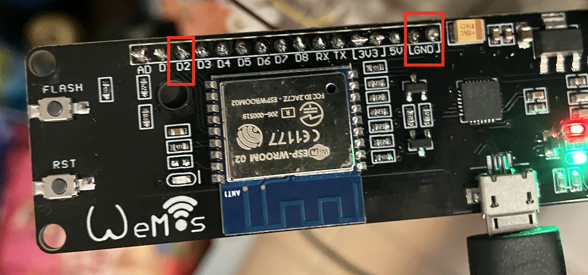

# Waterflow Senzor Esp-Wroom-02 a impulzuní senzor Sensus HRI

> I jako začátečním v ESPHome a vůbec v HomeAssistant jsem si dovolil udělat návod na meření spotřeby vody, aby když to bude někdo řešit, kdo bude nazačátku v HA, aby se nemusel trápit tako jako já :D Takže mě klidně opravte, když bych tu měl chybu a třeba to i někomu pomůže.

### Motivace

- Jelikož se stane, že občas vypadne elektrika, tak jsem si říkal, že už bych použil neco s baterry shieldem a vyšlo z toho ESP-Wroom-02 s baterkou 18650

## Hardware
 
- Deska Sspressif WeMos ESP-wroom-02 s baterií 18650 [WeMos ESP-WROOM-02 vývojová deska](https://www.laskakit.cz/wemos-esp-wroom-02-vyvojova-deska/)
- impulzní senzor na vodoměr Sensus HRI varianta A4 [Sensus snímač HRI](https://www.kapka-vodomery.cz/download/vodomery/prislusenstvi/sensus-snimac-hri.pdf)

## Použití

- vycházel jsem z už existujícího projektu, kde je použitá deska NodeMCU: [Build a cheap water usage sensor using ESPhome and a proximity sensor](https://www.pieterbrinkman.com/2022/02/02/build-a-cheap-water-usage-sensor-using-esphome-home-assistant-and-a-proximity-sensor/?fbclid=IwAR31Jy8ggQwYve9YchUbq6ylLgxr2Dd_sI1BzMqI2mSxeaGAOkKCJtEPZPA) - Zde jsem se inspiroval a požil kod a trochu ho poupravil pro potřeby ESP-Wroom-02.

# Sensus HRI
- v dokumentaci se dozvíte, že pro každé provedení (A1/A2/A3/ a v ném případe A4) mužě být zapojkení trochu jiné a vodiče mají jiný význam, proto si to zkontrolujte.

              

___

# WeMos ESP-wroom-02
- pinout desky může být náročné zjistit, protože se to může splést za vystupy na desce POZOR výstup D2 není to stejné jako GPIO2 potom v kodu
- je tedy potřeba zjistit na jaké výstupty na desce vedou GPIO, v mém případě v [Dokumentaci](https://www.studiopieters.nl/esp8266-esp-wroom-02-with-18650-battery/?fbclid=IwAR3pYxmAYj-FDfEqrm_vUxPI422bKUUkJtDhnZe3pk4s2nu2D7qoiI4uFco)
- já jsem použil pin D2 což je GPIO4

# Zapojení

 

- na pin D2 jsem připojil bílý vodič, což by měl být + (pulzy)
- na GND jsem připojil hnědý vodič (zem)
- Zjistíl jsem, že HRI má v sobě baterii takže se HRI napajet nemusí
- zlutý vodič jsem nepřipojoval v mé variantě A4 je žlutý vodič pro indikaci chyby

