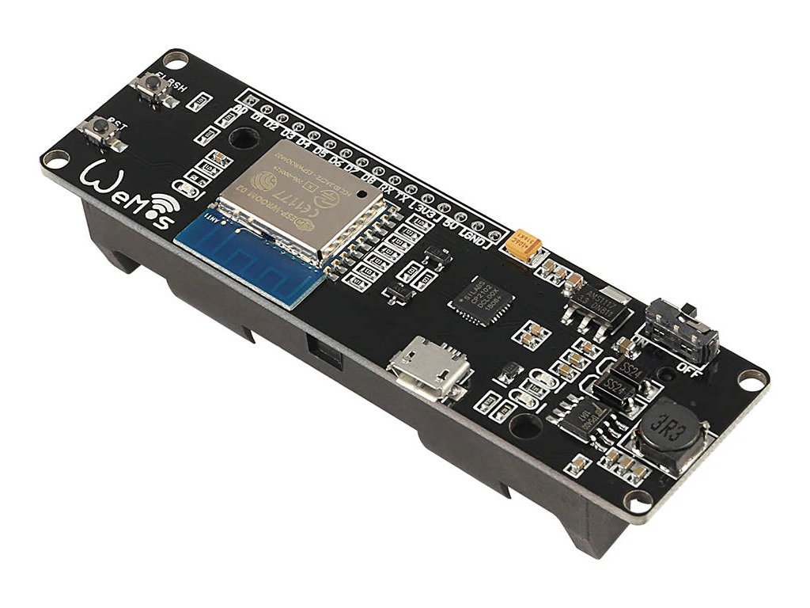

# Esp-Wroom-02 Waterflow Senzor

# Awesome README 
> A curated list of awesome READMEs
Elements in beautiful READMEs include, but are not limited to: images, screenshots, GIFs, text formatting, etc.

## Examplesddd

- [ai/size-limit](https://github.com/ai/size-limit#readme) - Project logo, clear description, screenshot, step-by-step installing instructions.
- [aimeos/aimeos-typo3](https://github.com/aimeos/aimeos-typo3#readme) - Project logo. Clear description of what the project does. Demo screenshot. TOC for easy navigation. Easy installation and setup sections with screenshots. Links for further reading.
